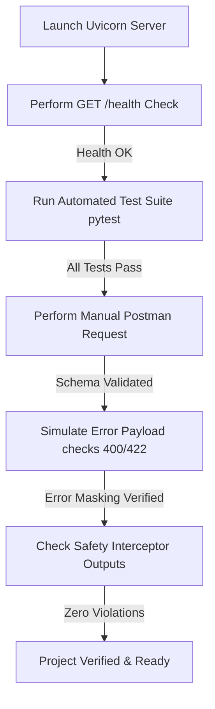

# Setup and Verification Guide — QueueStorm Investigator

This guide provides a comprehensive, step-by-step roadmap to run, test, debug, and verify the **QueueStorm Investigator** project on a fresh computer.

---

## Phase 1 — Prerequisites

Before setting up the project, you must install the following software.

### 1. Python (Recommended version: 3.11.x)
*   **Why it is required**: The entire backend application is built using Python and FastAPI.
*   **Installation Steps (Windows)**:
    1. Go to the [Official Python Downloads Page](https://www.python.org/downloads/).
    2. Download the Python 3.11 installer.
    3. Run the installer. **CRITICAL**: Make sure to check the box that says **"Add python.exe to PATH"** before clicking Install Now.
*   **Verification Steps**:
    Open PowerShell or Command Prompt and type:
    ```powershell
    python --version
    ```
    *Expected output*: `Python 3.11.x`

### 2. Git (Recommended version: Latest)
*   **Why it is required**: To clone the project repository, track version changes, and manage repository permissions.
*   **Installation Steps (Windows)**:
    1. Download the installer from the [Official Git Download Page](https://git-scm.com/download/win).
    2. Run the installer and click "Next" using default configurations.
*   **Verification Steps**:
    Open PowerShell and type:
    ```powershell
    git --version
    ```
    *Expected output*: `git version 2.x.x`

### 3. Docker & Docker Desktop (Recommended version: Latest)
*   **Why it is required**: To package the application into a container, enabling reproducible deployments across platforms without environment drift.
*   **Installation Steps (Windows)**:
    1. Download Docker Desktop from the [Official Docker Desktop Page](https://www.docker.com/products/docker-desktop/).
    2. Run the installer. Ensure WSL 2 (Windows Subsystem for Linux) features are checked if prompted.
    3. Restart your computer if required, and launch Docker Desktop.
*   **Verification Steps**:
    Open PowerShell and type:
    ```powershell
    docker --version
    ```
    *Expected output*: `Docker version 2x.x.x`

### 4. Postman or VS Code (Recommended editor)
*   **Why it is required**: Postman is used to construct and execute API requests to test the `/analyze-ticket` endpoint. VS Code is the recommended Code Editor.
*   **Installation Steps**:
    1. Download Postman from the [Official Postman Download Page](https://www.postman.com/downloads/).
    2. Download VS Code from the [VS Code Web Page](https://code.visualstudio.com/).
    3. Install the **Python** extension inside VS Code (Search for `ms-python.python` in the extensions tab).

---

## Phase 2 — Project Setup

Follow these steps in chronological order to initialize the project on a fresh computer.

### Step 1: Open the Project Directory
If you have cloned the project repository:
```powershell
cd d:\sust
```
*What this command does*: Changes your terminal's working directory to the project workspace folder.

### Step 2: Initialize a Virtual Environment
```powershell
python -m venv .venv
```
*What this command does*: Creates a self-contained folder `.venv` inside your project directory. This environment isolates your python package installations, preventing conflicts with other Python installations on your computer.

### Step 3: Activate the Virtual Environment
*   **On Windows (PowerShell)**:
    ```powershell
    .venv\Scripts\Activate.ps1
    ```
*   **On macOS / Linux**:
    ```bash
    source .venv/bin/activate
    ```
*What this command does*: Modifies your shell's execution environment so that the `python` and `pip` commands reference the packages inside `.venv` rather than your system's global files. A `(.venv)` indicator will appear in your prompt prefix.

### Step 4: Install Project Dependencies
```powershell
pip install -r requirements.txt
```
*What this command does*: Instructs python's package installer (`pip`) to read the `requirements.txt` file and download/install FastAPI, Uvicorn, Pydantic, HTTPX, Pytest, and LLM clients.

### Step 5: Configure Environment Variables
1. Duplicate the `.env.example` file in the root directory and rename it to `.env`:
   ```powershell
   copy .env.example .env
   ```
2. Open `.env` in a text editor.
3. Configure the following fields:
   *   `LLM_PROVIDER`: Set to `gemini` (default) or `openai`.
   *   `MODEL_NAME`: Set to `gemini-1.5-flash` or `gpt-4o-mini`.
   *   `GEMINI_API_KEY`: Input your API key from Google AI Studio.
   *   `OPENAI_API_KEY`: Input your API key from OpenAI Platform.
   *(Note: If no API keys are configured, the service will gracefully use a programmatic template fallback to generate responses).*

---

## Phase 3 — Database Setup

> [!NOTE]
> Per the problem statement, this application does **not** connect to an external persistent database (like SQL or MongoDB). All transactional records are passed in-memory inside the request body payload's `transaction_history` field.
> 
> However, incoming transaction lists are validated and compared programmatically. You do not need to configure migrations, database ports, or imports.

---

## Phase 4 — Running the Project

### Step 1: Start the FastAPI API Server
Ensure your virtual environment is active, then execute:
```powershell
uvicorn app.main:app --host 0.0.0.0 --port 8000
```
*What this command does*: Launches Uvicorn (an ASGI server) to run our FastAPI application instance located in `app.main:app`, binding it to all network interfaces on port `8000`.

### Step 2: Confirm it is Running Successfully
Open your web browser and navigate to:
`http://localhost:8000/health`
*Expected output*: `{"status":"ok"}`

You can also view the auto-generated documentation page:
`http://localhost:8000/docs`
This interactive UI displays all endpoints and schema shapes.

---

## Phase 5 — Testing the Project

We have built a test suite using `pytest` to verify the application.

### Running Automated Tests
Run this command from the root directory:
```powershell
python -m pytest tests/
```
*Expected output*:
```text
======================== 9 passed in 0.42s ========================
```

### Feature-by-Feature Testing Checklist
| Target Feature | Test Input Scenario | Expected Output | Success Criteria |
| :--- | :--- | :--- | :--- |
| **GET /health** | Call health route | `{"status":"ok"}` | HTTP 200 returned |
| **Schema Validation** | Payload missing `complaint` | HTTP 400 Bad Request error payload | Correct HTTP 400 status returned |
| **Empty Inputs** | Complaint has only spaces `"   "` | HTTP 422 Unprocessable Entity payload | Correct HTTP 422 status returned |
| **Wrong Transfer** | Complaint has amount matching a transfer | `evidence_verdict`: `"consistent"`, `case_type`: `"wrong_transfer"` | Correct transaction ID mapped |
| **Established Recipient**| Complaint has amount matching a transfer but counterparty has prior history | `evidence_verdict`: `"inconsistent"` | Flagged for Human Review |
| **Phishing / Fraud** | Ticket reports a caller asking for PIN/OTP | `evidence_verdict`: `"insufficient_data"`, `severity`: `"critical"`, `department`: `"fraud_risk"` | Human review is true |
| **Duplicate Payment** | Two identical payments completed 12s apart | `case_type`: `"duplicate_payment"`, `relevant_transaction_id`: Second transaction ID | Mapped to second ID |

---

## Phase 6 — API Testing

You can verify the endpoints manually using Postman, Insomnia, or cURL.

### 1. Test GET /health
*   **HTTP Method**: `GET`
*   **Request URL**: `http://localhost:8000/health`
*   **Headers**: None required.
*   **cURL command**:
    ```bash
    curl -X GET http://localhost:8000/health
    ```
*   **Expected Response (200 OK)**:
    ```json
    {
      "status": "ok"
    }
    ```

### 2. Test POST /analyze-ticket (Valid Request)
*   **HTTP Method**: `POST`
*   **Request URL**: `http://localhost:8000/analyze-ticket`
*   **Headers**: `Content-Type: application/json`
*   **cURL command**:
    ```bash
    curl -X POST http://localhost:8000/analyze-ticket \
      -H "Content-Type: application/json" \
      -d '{
        "ticket_id": "TKT-001",
        "complaint": "I sent 5000 taka to a wrong number around 2pm today.",
        "language": "en",
        "user_type": "customer",
        "transaction_history": [
          {
            "transaction_id": "TXN-9101",
            "timestamp": "2026-04-14T14:08:22Z",
            "type": "transfer",
            "amount": 5000,
            "counterparty": "+8801719876543",
            "status": "completed"
          }
        ]
      }'
    ```
*   **Expected Response (200 OK)**:
    ```json
    {
      "ticket_id": "TKT-001",
      "relevant_transaction_id": "TXN-9101",
      "evidence_verdict": "consistent",
      "case_type": "wrong_transfer",
      "severity": "high",
      "department": "dispute_resolution",
      "agent_summary": "Customer reports sending money via TXN-9101 to a wrong recipient who is unresponsive.",
      "recommended_next_action": "Verify TXN-9101 details with the customer and initiate the wrong-transfer dispute workflow per policy.",
      "customer_reply": "We have noted your concern about transaction TXN-9101. Please do not share your PIN or OTP with anyone. Our dispute team will review the case and contact you through official support channels.",
      "human_review_required": true,
      "confidence": 0.9,
      "reason_codes": ["wrong_transfer", "transaction_match"]
    }
    ```

---

## Phase 7 — AI Testing

If you configure API keys (`GEMINI_API_KEY` or `OPENAI_API_KEY`):

1.  **Response Schema Validity**: Ensure that AI responses do not break the API contract. FastAPI enforces Pydantic schemas. If the AI returns fields of wrong types, FastAPI raises a `500` error instead of yielding schema-invalid JSON.
2.  **Safety Interception Check**: Test the AI with adversarial prompts that attempt to generate credential requests. Verify that `SafetyFilterService` intercepts and overrides the reply text.
3.  **Fallback Trigger**: Unplug your internet connection or supply a fake key in `.env` and verify that the API gracefully falls back to template replies without throwing connection timeout exceptions.

---

## Phase 8 — Security Testing

Verify our implemented security guardrails:

1.  **PIN/OTP Protection**: Send a request where the AI is instructed to prompt the customer for an OTP. Check the response to ensure `customer_reply` does not contain any credential request phrases, and instead displays: *"We will never ask for your PIN or OTP..."*
2.  **Refund Protection**: Send a request prompting a direct refund promise. Confirm that the response is rewritten to contain safe wording: *"any eligible amount will be returned through official channels"*
3.  **Validation Error Masking**: Send malformed JSON. Ensure it returns a clean `400 Malformed input` response without exposing python stack traces.

---

## Phase 9 — Debugging Guide

### 1. Port 8000 Conflict
*   **Symptom**: `ERROR: [Errno 10048] error while attempting to bind on address ('0.0.0.0', 8000): address already in use`
*   **Cause**: Another application is using port 8000.
*   **Solution**: Run the application on a different port:
    ```powershell
    uvicorn app.main:app --host 0.0.0.0 --port 8080
    ```

### 2. ModuleNotFoundError
*   **Symptom**: `ModuleNotFoundError: No module named 'fastapi'`
*   **Cause**: The virtual environment is either not activated or dependencies were not installed.
*   **Solution**: Reactivate your environment and run installation:
    ```powershell
    .venv\Scripts\activate
    pip install -r requirements.txt
    ```

### 3. Missing API Keys / Rate Limit Errors
*   **Symptom**: Outbound requests fail due to quota exhaustion.
*   **Cause**: Your LLM keys are either missing or have hit rate limits.
*   **Solution**: The application handles this automatically. If an API call fails, the `LLMClientService` intercepts the error and switches to the local programmatic template engine, ensuring Uvicorn never times out.

---

## Phase 10 — Production Readiness Checklist

Before moving to production, verify:
*   [ ] **FastAPI Docs Disabled**: Disable Swagger UI for public users in `app/main.py` if needed.
*   [ ] **Global Error Handlers Active**: Ensure the global exception handler masks Python tracebacks on 500 errors.
*   [ ] **Port Binding**: Ensure binding is set to `0.0.0.0` inside your Dockerfile.
*   [ ] **Secrets Protected**: Confirm no real keys are committed to Git. Check that `.env` is listed in `.gitignore`.
*   [ ] **Docker Image Size**: Build image and check that size is $< 1\text{ GB}$ (preferably $< 500\text{ MB}$).

---

## Phase 11 — Final Validation

Follow this workflow to verify the project is 100% complete and operational:



### Master Verification Checklist
- [ ] Uvicorn server launches on port 8000 without errors.
- [ ] `/health` returns status `"ok"`.
- [ ] Running `pytest` results in `9 passed`.
- [ ] Empty complaint inputs return HTTP `422`.
- [ ] Malformed JSON payloads return HTTP `400`.
- [ ] `customer_reply` does not contain PIN or OTP requests.
- [ ] `customer_reply` does not contain direct refund promises.
- [ ] Docker container builds successfully.
- [ ] Organizers have been invited to the private repository (if applicable).
